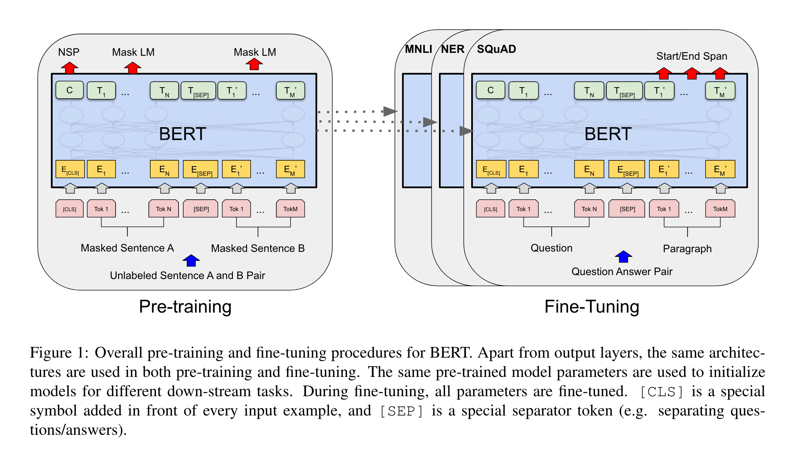
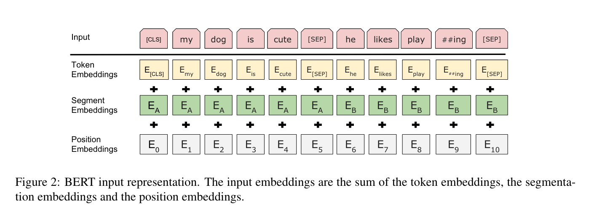

# 背景   
1. 在计算机视觉领域：   
- 在计算机视觉领域的发展早期，研究人员发现，可以先在一个大型的数据集（比如 ImageNet）上训练一个卷积神经网络（CNN）模型。训练完成后，这个模型就能学到很多通用的图像特征（比如边缘、形状、纹理等），这些特征对各种视觉任务都是有用的。

- 然后，我们就可以把这个已经训练好的模型迁移到其他计算机视觉任务上（比如图像分类、物体检测、图像分割等），通过微调（fine-tuning）或者作为特征提取器来用，从而提升这些任务的性能，即让它们表现得更好、识别更准。

- 这就是“迁移学习（Transfer Learning）”的一个经典做法，也说明了CNN模型具有良好的通用性。        
2. 在自然语言处理领域：       
- 但是在 BERT 出现之前，NLP 领域并没有一个像 CNN + ImageNet 那样的统一框架——也就是说，没有一种预训练的深度模型可以很好地迁移到各种 NLP 任务（如问答、情感分析、命名实体识别等）中。

- 因为缺少统一的预训练模型，NLP 的研究者或者工程师们往往要为每个具体任务单独设计神经网络结构并从头训练，这既费时又不容易取得很好的效果。

- BERT 可以在大规模语料上预训练，然后迁移到不同的 NLP 任务中，取得很好的效果，像“CV 里的 CNN+ImageNet”那样，在 NLP 里实现了“预训练 + 微调”的范式。

- BERT 不仅让模型训练过程更简单（不用从零设计架构），还能让模型效果更好。

**BERT**也是站在巨人的肩膀上的。

# 摘要

**BERT**，它的全称是 Bidirectional Encoder Representations from Transformers，即“来自 Transformer 的双向编码器表示”。

与当时的一些语言表示模型（如 Peters 的 ELMo 和 Radford 的 GPT）不同，BERT 的设计目标是在所有网络层中同时考虑句子的左侧上下文和右侧上下文，来预训练深层的双向语言表示。而早期模型大多是单向的（只能看左边或右边）。

> 这里来解释一下为什么不同：
**ELMo（Embeddings from Language Models，2018）**：        
    - 特点：双向 LSTM   
    - 原理： ELMo 使用一个前向（left-to-right）LSTM 和一个后向（right-to-left）LSTM，分别读取句子。
    - 问题： 虽然它是“前向 + 后向”，但这两个方向是分开训练的，不是“同时考虑左右”。    
    - 层级处理： 它的双向性不是在每一层都共同作用，而是最后将两个方向的输出拼接起来。      
所以，ELMo 是“浅层双向”而不是 BERT 那种“深层双向”。       
**GPT（Generative Pre-trained Transformer，2018）**：
    - 特点：单向 Transformer（只看左边）            
    - 原理： GPT 使用标准的 Transformer decoder 架构，在训练时只看每个词的左边上下文（即过去的词）。          
    - 限制： 模型在预测一个词时，不能看到右边，否则就不是“自回归语言建模”了。             
所以 GPT 是“严格单向”，只有“从左到右”的信息流。         
**BERT（Bidirectional Encoder Representations from Transformers，2018）**：         
    - 特点：真正的“深层双向”Transformer           
    - 原理： BERT 使用 Transformer encoder，训练时通过 Masked Language Modeling（MLM），随机遮掉句中的部分词，然后让模型根据上下文去预测它。               
    - 优势： 因为每个被遮住的词周围的词都可以来自左边和右边，所以 BERT 在每一层都同时考虑左、右上下文。             
BERT 是“jointly conditioning on both left and right context in all layers”，这是它和 ELMo/GPT 最大的区别。             
> > 这里我对这个优势的理解是：它能够在模型的每一层中，同时利用一个词的左边和右边的信息（上下文）来理解这个词的含义。             

因此，BERT 预训练模型只需要在其上面添加一个任务相关的输出层，然后进行微调（fine-tuning），就可以在各种 NLP 任务（如问答、语言推理等）上获得非常好的效果，而不需要对整个模型结构做复杂的任务专属改动。    

BERT 的概念上很简单，但效果上非常强大。BERT 在 11个自然语言处理任务上都刷新了最新的最优性能（state-of-the-art），然后便是一些BERT的战绩：        
- GLUE 总得分提升至 80.5%，比之前最好结果提升了 7.7 个百分点。
- MultiNLI 准确率提升到 86.7%，提升了 4.6 个百分点。
- SQuAD v1.1（问答任务）F1 提升到 93.2，提升 1.5 个百分点。
- SQuAD v2.0 测试集 F1 提升到 83.1，提升了 5.1 个百分点。

摘要总结：
	1.	BERT 是一个基于 Transformer 的双向语言表示模型。
	2.	它可以在不带标签的文本上预训练，然后通过微调迁移到各种任务。
	3.	不同于早期只考虑单向上下文的模型，BERT 从一开始就使用了双向上下文。
	4.	不需要设计任务专属结构，只需加一个输出层就能适配各种任务。
	5.	它在一系列主流 NLP 任务中刷新了 SOTA（最优性能），表明它效果强大。

# 1 引言

引言上来先说明语言模型的预训练已经被证明能够显著提升很多自然语言处理任务的性能。      
括号里提到的是几篇相关的重要论文，包括：
- Dai & Le (2015)：比较早期的预训练思想，提出在序列建模中使用未标注数据预训练。
- Peters et al., 2018a：就是提出 ELMo 的论文。
- Radford et al., 2018：就是第一版 GPT。
- Howard and Ruder, 2018：提出了 ULMFiT，一种迁移学习方法。        

> 这些工作都在推动一个共同方向：先用大量无监督文本预训练模型，再用于下游任务微调。

这些任务包括了“句子级别”的任务，比如：
- 自然语言推理（NLI）：判断两个句子之间的逻辑关系（比如：蕴含、矛盾、中立）。
  - Bowman et al., 2015：SNLI 数据集。
  - Williams et al., 2018：MultiNLI 数据集。
- 句子复述识别（Paraphrasing）：判断两个句子是否表达相同含义。引用的是微软的著名 MSRP 数据集（Dolan and Brockett, 2005）。

> 这些任务的目标是通过“理解整体”来判断句子之间的关系。

除了句子级别的任务，还有 “词级别”任务，比如：
- 命名实体识别（NER）：识别句子中哪些词是人名、地名、机构名等。
  - 对应数据集：CoNLL-2003（Tjong Kim Sang & De Meulder）
- 问答（QA）：例如在 SQuAD 任务中，模型需要在段落中找出正确的答案位置。
  - 对应数据集：SQuAD（Rajpurkar et al., 2016）

> 这些任务的特点是：模型要对每一个词进行精细判断，输出粒度非常细。

现有的将预训练语言表示应用于下游任务的方法主要有两种：
- 基于特征的方法（feature-based）
- 微调的方法（fine-tuning）

Feature-based（以 ELMo 为代表）：基于特征的方法是将预训练模型作为一个特征提取器（feature extractor）来使用。也就是说，我们使用预训练语言模型（如 ELMo）对文本进行编码，提取出语义表示向量（embedding），然后把这些向量输入到我们自己设计的任务模型中（比如一个分类器、一个序列标注模型等），进行下游任务。
关键点：
- 预训练模型的参数不更新，只用它提取表示。
- 下游任务的模型（比如分类器）会被单独训练。

Fine-tuning（以 GPT 为代表）：微调的方法是将预训练模型和下游任务模型联合训练。即，我们在加载预训练语言模型之后，会加入一个任务特定的输出层（例如分类器），然后对整个模型（包括预训练部分）一起进行训练，通过在下游任务数据上的梯度反向传播来微调预训练模型的参数。
关键点：
- 预训练模型的参数会被更新。
- 下游模型只是预训练模型上增加的一小层，通常是 task-specific 的输出层。

两种方法的共同点：这两种方法（ELMo 和 GPT）虽然应用方式不同，但它们在预训练阶段有一个共同点：
- 都使用 单向语言模型（unidirectional language models） 来学习通用的语言表示。
  - ELMo 是前向 + 后向 LSTM（但独立）
  - GPT 是只看左边的 Transformer（单向）

**这里引出了BERT的不同** ：也就是说，它们虽然都能从大语料中学到一些通用知识，但它们的“看世界方式”是单向的，不如 BERT 那样“左右都看”。

作者认为，当前的方法限制了预训练语言表示的潜力，尤其是对于 **微调型方法（fine-tuning）** 来说更是如此，它们都没能充分发挥预训练模型的表达能力。
一个主要的限制是：标准语言模型是“单向”的（只能从左到右，或从右到左）。
1. 这种限制限制了在预训练阶段可以使用的模型结构的选择。大多数语言模型（像 GPT）只能看句子的“过去”——比如预测一个词只能看到左边的词，而不能看到右边的词。这种设计对某些任务效果不好。
2. 模型不能完整地看到预测词的上下文，这样对理解语义是有限的。这种单向的限制，对于“句子级任务”来说表现可能不理想；而在一些“词级任务”中（例如问答），这种限制可能非常有害，因为这类任务必须同时利用左边和右边的上下文信息。

接下来，作者开始从动机、关键设计、贡献来对BERT进行总结。         
BERT：是一种改进了传统微调方法的语言预训练模型，使用“双向 Transformer 编码器表示”方法。           
1. 避免单向性的限制（核心创新）：使用“掩码语言模型（Masked Language Model, MLM）”来克服传统模型“只能单向理解”的局限。
    - 以前的模型（如 GPT）只能从左往右读；
    - BERT 则通过 MLM 可以在训练时同时看到一个词的左边和右边。
> MLM 受启发于 Cloze 任务:”…inspired by the Cloze task (Taylor, 1953).”               
“填空题（Cloze test）”：            
&emsp;给你一句话，遮掉某个词，让你根据上下文来猜这个词。          
&emsp;这就是 BERT 的预训练核心目标。

2. MLM 是怎么工作的？
    - 输入中随机遮住一些词（比如用 [MASK] 替代），
    - 模型根据它前后的词，预测原来的词是什么。

> 这个训练方式让模型能同时“看左边”和“看右边”，实现真正的双向建模。

3. 与 GPT 的单向训练对比:
    - GPT：只能用左边上下文；
    - BERT：通过 MLM，可以融合左右两边的上下文，训练出深层双向的 Transformer 表示。

4. 另一项预训练任务NSP,除了 MLM，BERT 还加入了另一项训练任务：“下一句预测”（Next Sentence Prediction, NSP），用于学习句子对之间的关系。
    - 句子 A 是不是紧接着句子 B？
    - 适用于问答、句子推理等任务。

总结贡献：         
- 验证双向预训练的重要性：对比 GPT（单向）和 ELMo（浅层拼接双向），BERT 通过 MLM 实现了真正的深层双向训练，是模型具备了更强的表达能力，更适合复杂语言理解任务。
- 减少人工设计结构的需求：不需要为每个任务专门设计模型结构，只要在训练好的模型后加一层输出头部就可以直接迁移，而且效果比很多复杂的“手工设计”模型还好！
- 刷新了多个 NLP 任务的性能纪录：无论是句子级任务（如自然语言推理、语义匹配），还是词级任务（如命名实体识别、问答），所有任务都达到了当时最好的结果。
- 开源万岁：[代码和预训练模型](https://github.com/google-research/bert)

# 2 相关工作

本节简要回顾了 **pre-training general language representations（预训练通用语言表示模型）** 最常用的方法。

## 2.1 Unsupervised Feature-based Approaches

本小节重点介绍了 BERT 出现之前已有的 **无监督特征提取型预训练方法（feature-based approaches）** 的 **Related Work（相关工作）**。

1. 首先是词表示的演变

长期以来，自然语言处理（NLP）领域一直在研究如何学习通用的词表示（word representations）。           
这些方法包括：      
- 非神经网络方法：如 Brown clustering（Brown et al., 1992）
- 神经网络方法：如：
    - ord2Vec（Mikolov et al., 2013）
    - GloVe（Pennington et al., 2014）

这些模型产生了“词嵌入向量（word embeddings）”，是现代 NLP 系统的重要组成部分，能比从零训练的表示效果好很多（Turian et al., 2010）。

2. 词向量如何预训练

为了训练这些词向量，研究者使用了许多不同的目标函数（objectives），包括：      
- 左到右语言模型目标（如 Mnih and Hinton, 2009）：给定前面的词预测下一个；
- 区分正确/错误词的上下文目标（如 Mikolov et al., 2013）：Skip-gram 模型，用上下文来预测中心词，或反过来。

这些目标都是“无监督的”，依赖于大规模文本，而不需要人工标注。

3. 从词到句的表示发展

随着研究的进展，人们开始从“词”向“句子”甚至“段落”级别的表示发展，比如：         
- 句子嵌入（Kiros et al., 2015；Logeswaran and Lee, 2018）
- 段落嵌入（Le and Mikolov, 2014）          

这些研究提出了一些训练目标，例如：
- 选句子的排序任务（Jernite et al., 2017）
- 左到右生成下一句（Kiros et al., 2015）
- 去噪自编码器（denoising autoencoder） 目标（Hill et al., 2016）

所有这些目标都是为了让模型学会句子或段落的通用表示。

4. ELMo 的贡献与特点

ELMo 是在传统词嵌入基础上进行的重要扩展。它的特点是：          
- 上下文相关表示：同一个词在不同上下文中有不同表示；
- 使用的是一个 从左到右 + 从右到左的语言模型（双向 LSTM）；
- 每个词的最终表示是左右两个方向的拼接（不是融合）。

所以说 ELMo 是 feature-based、浅层双向，不是深层双向（如 BERT）。
> ELMo 的用法是把它生成的向量加到原来的任务模型里当“额外特征”用。它在很多任务中都带来了提升，例如：             
	•	问答（Rajpurkar et al., 2016）          
	•	情感分析（Socher et al., 2013）          
	•	命名实体识别（Tjong Kim Sang and De Meulder, 2003）        

5. 与 ELMo 类似的其他方法

这里提到了一个与 ELMo 类似的模型（Melamud et al., 2016）：      
- 使用 LSTM 来同时看左右上下文；
- 目标是根据上下文预测某个词。

这与后来的 MLM 思想有些接近，但它也属于浅层拼接，没有深层融合。

6. 此外还提到 Cloze 任务（即填空题）可以用来提高文本生成模型的健壮性。

## 2.2 Unsupervised Fine-tuning Approaches（无监督微调方法）

1. 早期方法只是预训练词向量

和 feature-based 方法一样，最早的无监督微调方法其实也只是从无标注文本中学习词向量参数而已。
- 比如 Collobert 和 Weston（2008）是较早的尝试；
- 他们的方法并不是训练完整的上下文模型，而是预训练词嵌入（embedding）后用于下游任务。

2. 最近的主流是预训练整个句子/文档编码器

近几年，研究者开始预训练能输出上下文相关词表示的句子编码器或文档编码器。这类模型的流程是：          
&emsp;&emsp;&emsp;1. 在大规模无标注文本上做预训练；
&emsp;&emsp;&emsp;2. 然后将整个模型用于下游任务并进行微调（fine-tune）。

其中包括：         
- Dai & Le (2015)：对 LSTM 进行语言建模预训练并迁移；
- Howard & Ruder (2018)：提出 ULMFiT，在语言模型基础上进行微调；
- Radford et al. (2018)：就是 GPT 模型。

3. 这类方法的主要优点

这类微调方法的一个明显优势是：

- 在处理下游任务时，只需学习很少的新参数，因为预训练模型已经学到了大量通用的语言知识。

相比起 feature-based 方法里每次都要单独设计结构，这种方式更简洁高效。

4. 成功案例：GPT

GPT 就是这种方法的一个代表性成功案例：       
- 使用左到右的语言模型目标做预训练；
- 然后在下游任务上进行 fine-tune；
- 成功刷新了多个句子级任务的最好表现（基准是 GLUE 任务集）。

5. 总结

说明“无监督微调方法”所采用的预训练目标函数主要是：       
- 单向语言建模（GPT、ULMFiT）
- 自编码器型重建（Dai and Le）

为接下来介绍 BERT 的创新点（使用双向 MLM 来做深层预训练）做铺垫。

## 2.3 Transfer Learning from Supervised Data

本段阐述了从有大规模标注数据的监督任务中学习到的模型，也可以迁移到其他任务中，效果很好。无论书NLP还是CV领域都已经有很成功的例子。         
1. NLP：
- 自然语言推理（NLI）：Conneau 等人（2017）提出了 InferSent —— 在大规模 NLI 数据集（如 SNLI）上训练句子编码器，然后迁移到其他任务；
- 机器翻译（MT）：McCann 等人（2017）提出了 CoVe —— 在机器翻译任务中训练 LSTM 编码器，然后用于其他下游任务。

2. CV：
- Deng et al., 2009：ImageNet 数据集的原始论文；
- Yosinski et al., 2014：探讨了迁移深度特征表示的有效性。

为后文介绍BERT提供更大视角背景：BERT是**无监督迁移学习**，但与**监督迁移学习**一样强大，甚至更灵活。

# 3 BERT

本节主要介绍了下面几个部分：
1. BERT 的训练流程（预训练 + 微调）
2. BERT 的架构（基于 Transformer）
3. BERT 模型的两个版本（Base 和 Large）
4. 与 GPT 的架构对比（双向 vs 单向 self-attention）

BERT 的训练流程分为两个阶段：
- 预训练（pre-training）：
    - 使用大量的无标注文本数据（如 Wikipedia、BookCorpus）；
    - 目标是让模型学到通用的语言知识；
- 微调（fine-tuning）：
    - 在具体任务上，用有标签的数据对模型进行调整；
    - 每个下游任务（如问答、文本分类等）都单独训练一个版本。

每个任务用的是同一个预训练模型的参数初始化，然后再微调（这就是迁移学习的精髓）。        

        
      
Figure 1：该图展示了整个 BERT 模型的预训练（Pre-training）与微调（Fine-tuning）流程：         
- 左边：BERT 的 预训练阶段（Pre-training）
- 右边：BERT 在不同任务上的 微调阶段（Fine-tuning）

一、左侧：Pre-training（预训练）

核心思想：
- BERT 在大规模语料上通过两个任务来进行预训练：
- Masked Language Model（MLM）
- Next Sentence Prediction（NSP）

输入形式：
- 输入的是两个句子（Sentence A 和 Sentence B）
- BERT 使用 [CLS] 作为整个句子的起始标志，[SEP] 作为句子之间的分隔符。
- 每个 token（Tok）都会被编码成三种信息的融合：
    - Token Embedding（词嵌入）
    - Segment Embedding（句子A or B）
    - Position Embedding（词在句子中的位置）
> 对[CLS]有疑问可以问问GPT或者看看同目录下的 **`BERT_CLS.md`**（虽然也是问GPT），解释的很清楚。

预训练任务详解：

1. Masked Language Model（MLM）
    - 随机遮盖输入中的一些 token，例如把 “I love this [MASK]”。
    - 模型的任务是预测被遮住的 token。
    - 这是**双向语言模型**的体现（BERT 最大创新）：可以利用上下文两边的信息。

图中红色箭头 “Mask LM” 就是这个任务，表示模型预测被 mask 的位置。

2. Next Sentence Prediction（NSP）
    - 模型还需要判断：句子 B 是否真的是句子 A 的下一句？
    - 一半的训练样本是真实的句子对，另一半是随机配对。

图中红色箭头 “NSP” 就是这个任务的输出。

二、右侧：Fine-tuning（微调）

**核心思想**：在不同的下游任务中，在 BERT 的预训练模型基础上，加一个轻量的任务特定层（如分类器、指针等），然后对整个模型一起训练（微调）。

图中展示了三个任务：

1. MNLI（自然语言推理）/NER（命名实体识别）
    - 输入：两个句子
    - 目标：判断关系/抽取实体
    - 输出形式：分类标签（如 entailment / contradiction）或序列标签（如 PER, LOC）

使用 [CLS] 向量进行分类。

2. SQuAD（问答任务）
    - 输入：问题 + 段落
    - 目标：找出答案在段落中的起始位置和结束位置
    - 输出：Start 和 End 的 token 位置（两个 softmax）

图中红色箭头“Start/End Span”表示要预测答案起始和结束的 token。

微调期间的特点：        
- 输入格式和预训练一样：[CLS] Sentence A [SEP] Sentence B [SEP]
- 微调时：
    - 模型的所有参数都会更新
    - 但结构不变，只是加入一个 task-specific 的输出层

看完图片我们继续回到正文。

BERT 一个显著的特点是：不同任务之间不需要改模型结构！         
只需要：
- 用同一个 Transformer 编码器结构；
- 加一个任务相关的输出层（如分类器）；
- 然后微调整个模型。

对比之前的方法（如 ELMo 需要定制结构），这大大简化了流程。

BERT 的核心结构是基于 Vaswani 等人提出的 Transformer Encoder：         
- 是一个多层（multi-layer）的编码器；
- 支持深层双向 self-attention，也就是：
- 每个词可以同时看左边和右边的词；
- 不像 GPT 只能看左边。

> 作者说实现几乎和原始的 Transformer 一样（参考 Vaswani et al., 2017），所以不再赘述。这里引用了一个质量非常高的Transformer教学文章：[The Annotated Transformer](https://nlp.seas.harvard.edu/2018/04/03/attention.html)很推荐看。

BERT 有两个主版本（都是 encoder-only）：
| 名称 | 层数L | 隐藏维度H | Attention头数A | 参数量 |
| :--- | :---: | ---: | ---: | ---: |
|BERT~BASE~|12|768|12|110M|
|BERT~LSRGE~|24|1024|16|340M|

BERT~BASE~在很多任务上效果远超 GPT。      
> 我认为看看就好

接下来是BERT 的输入和输出表示（Input/Output Representations）

为了让 BERT 能支持多种下游任务（如问答、分类、推理等），模型的输入设计要能明确地表示：
- 单个句子
- 或者一对句子（例如问题和答案）

而且这些句子都必须能表示为一个统一的 token 序列，送进模型。
“句子”其实可以泛指一段连续的文本，不一定是语法意义上的完整句子。

BERT 使用的是 WordPiece 分词方法（Google 提出的子词单元方法），词表大小为 30,000。对输入句子进行分词后，会得到一系列 token，每个 token 被转换成向量。

对于输入的句子对会被合并成一个输入序列，区分句子、明确它们各自的边界和归属的方法有两种：
1. 用 [SEP] 标记分割两个句子
2. 给每个 token 加一个 segment embedding（表示它是属于句子A还是句子B）

**Token**的表示由三部分组成（如下图Figure2所示）：
- 每个 token 的最终输入向量 = 词嵌入（Token Embedding） +  句子嵌入（Segment Embedding） +  位置编码（Position Embedding）       

       
        
| 成分                          | 是否学习                     | 含义                         |
|-----------------------------|----------------------------|----------------------------|
| Token Embedding（词嵌入）       | 学习得来                  | 每个词的基本向量表示             |
| Segment Embedding（句子类型）   | 学习得来                  | 句子 A (0) vs 句子 B (1)     |
| Position Embedding（位置编码） | 学习得来（在 BERT 中是可学习的位置编码） | 词在句子中的位置信息           |

无论你是属于句子A还是B，也无论你是在第几位（第1个词、第5个词、第100个词），BERT都会给你分配一个可以学习的向量，作为你输入表示的一部分。

## 3.1 Pre-training BERT

与 ELMo（Peters et al., 2018a） 和 GPT（Radford et al., 2018） 不同，BERT 没有使用传统的单向语言模型来进行预训练，而是实现了“真正的双向建模”。

BERT 的预训练采用了两种无监督任务（详细介绍）：
1. Masked Language Model（MLM）
2. Next Sentence Prediction（NSP）

这两个任务共同训练出 BERT 的深层双向语言理解能力（Figure 1左边部分可以看到这两个任务的结构可视化，其实前面讲这个图的时候已经讲过了）

### Task #1: Masked LM

**1. 为什么需要 MLM？**

直觉上，作者相信，一个深度的双向模型（能同时看左和右）肯定比单向模型更强，也比左右两个方向拼接起来的模型（比如 ELMo）更强。     
但是标准的语言模型（如 GPT）只能左到右或右到左地训练，因为如果允许每个词看到整个上下文，它就能“看到自己”，这会让任务变得太简单（预测没意义）。

**2. 引入 Masked LM**

为了训练这种真正双向的模型，作者使用了Masked Language Model（MLM）：
- 做法：在输入序列中随机遮盖（mask）一些词，然后让模型预测被遮盖的词是什么；
- 类似于 “填空题（Cloze test）”；
- 模型输出 [MASK] 所在位置的向量，然后经过 softmax 输出词表，预测最可能的词。      

**3. 具体设置（15% masking）**

在所有实验中：
- 对每个输入序列，随机选择 15% 的 token 来进行遮盖（mask）；
- 然后模型只需预测这些被遮住的词；
- 和自编码器（autoencoder）不同，BERT 只预测被遮住的词，不重建整个句子。

**4. 训练-微调不匹配问题**

这种方法虽然能训练出强大的双向模型，但有一个问题：
- 在预训练时使用了 [MASK]；
- 可是在微调时（用于下游任务），输入中不会有 [MASK]，

> 这里会存在这样的问题：          
如果训练的时候总是用 [MASK] 来遮住词，那么模型只在预训练时见过 [MASK]，但在实际下游任务（如情感分类、问答）中，不会再出现 [MASK]。           
于是模型就学会了一个“非自然语言的作弊手段”：一看到 [MASK] 就知道要预测，可能学到的只是“识别 [MASK] 的技巧”，而不是“真正理解上下文”。         
所以模型在训练和实际应用中会出现 “训练-微调不匹配”（mismatch）。           

为了减少这种不一致，BERT 使用了一种巧妙的处理方法：
- 对于被选中 mask 的 15% 词汇，实验做如下操作：

| 替换方式 | 概率 | 说明 |
| :---: | :---: | :---: |
| 替换为[MASK] |80%|正常掩盖方式|
| 替换为随机词 |10%|增加扰动，防止模型只记住mask模式|
| 保持不变|10%|引入预测难度，模型必须猜“看起来没变”的词|

然后，用这些位置上的输出向量 `T~i~` 来预测原始词（用 softmax），优化目标是**交叉熵损失（cross-entropy loss）**。
这样模型能学习到通用的“语言理解能力”而不是“特殊的信号识别”。
> 在论文的附录 C.2 中，作者还比较了不同的 Masking 策略对模型效果的影响。    

### Task #2: Next Sentence Prediction (NSP)

**1. 为什么需要 NSP？**

许多重要的下游任务（如问答 QA、自然语言推理 NLI）都依赖于理解两个句子之间的“关系”：
- QA：问题和段落之间有没有答案关系？
- NLI：句子A是否蕴含句子B？

然而，传统语言模型并不能直接捕捉这种句间关系，因为它们一般只建模词或句子的内部结构。

**2. NSP 是怎么构造的？**

为了训练模型具备“理解句子间关系”的能力，BERT 引入了一个非常简单的任务：    
“下一句预测（NSP）”：判断两个句子是否在原文中是相邻的。    

它是一个二分类任务（是/否）：
- IsNext：B 是 A 的下一句（真实连续）；
- NotNext：B 是随机从语料中选的，与 A 无关。
> 两者各占50%    

**3. NSP 的输入表示（看Figure 1）**

在 BERT 的输入中，[CLS] token 的输出向量 C 被用于 NSP 任务的分类输入。
这也是为什么 [CLS] 的输出很重要 —— 它代表了整个句子对的综合语义。

虽然 NSP 的设计很简单，但实验表明：

- 这种预训练方式对于 **问答（QA）和推理（NLI）**等任务效果非常好。
>Section 5.1提供了性能提升的实证数据

**4. NSP 与早期工作对比**

NSP 任务其实和之前一些论文提出的目标函数类似，比如：
- Jernite et al., 2017
- Logeswaran and Lee, 2018

它们也试图用上下句之间的关系来训练句子表示。

不同的是：
- 以往的模型只是训练“句子级别的 embedding”，但 BERT 是将所有参数都迁移到下游任务中继续训练的（end-to-end fine-tuning），这效果更强。

作者也在注释中说明了：向量 C（即 [CLS] 输出向量）在未经过微调时，并不是有意义的句子表示，因为它是通过 NSP 训练获得的。
也就是说：
- 向量 C 就是 BERT 中 [CLS] 位置输出的向量，通常被拿来代表“整个句子的语义”。
- 但这里指出：在仅靠预训练（尤其是 NSP）时，这个向量并不一定是“通用的、语义上完整的”句子表示。
- 只有在你用它去微调具体任务（比如分类、句子相似度）之后，它才会学到真正有意义的句子表示。

### Pre-training data

BERT 的预训练过程基本遵循了前人关于语言模型预训练的研究经验，依旧使用大规模未标注文本，通过无监督目标（如 MLM 和 NSP）进行训练。

BERT 使用的预训练语料来自两个主要来源：
|语料库|大小|说明|
| :--: | :--: | :--: |
|BooksCorpus|8亿词（800M）|来自小说等免费书籍文本（Zhuetal.，2015）|
|Wikipedia|25亿词（2,500M）|英文维基百科（只保留正文段落）|

作者强调了一点很重要：一定要用文档级别的连续语料，而不能用打乱顺序的句子集合（如 Billion Word Benchmark）。
原因是：
- 句子之间要保持上下文联系，便于训练句子对的关系（如 NSP）；
- 如果把句子都打乱，模型就学不到“段落上下文结构”，训练出来的表示会比较碎片化、不连贯。

## 3.2 Fine-tuning BERT

本小节说明了为什么 BERT 可以统一架构、简单微调、适配多任务，同时也解释了它在多个下游任务中表现优异的原因。

**1. BERT 微调的简洁性和灵活性**

由于 Transformer 的**自注意力机制**具备强大的灵活性，BERT 能够非常简单地微调用于各种下游任务。
- 无论任务是 单文本输入（如情感分析）
- 还是文本对输入（如句子蕴含、问答等）

你只需要换掉输入和输出的部分即可，不需要改模型结构。

这一点是 BERT 强大泛化能力的重要原因。

**2. 与传统模型的不同（处理文本对的方式）**

传统处理文本对的方法（如 Parikh et al., 2016；Seo et al., 2017）通常是：
- 先分别编码两个句子（A 和 B），
- 然后再在它们之间引入“交叉注意力”或对齐机制。

而 BERT 则不一样：
- 它把两个句子拼接成一个整体序列，用 [SEP] 分隔；
- 然后用 Transformer 的 自注意力机制直接编码整个序列；
- 这样天然地实现了双向跨句关注（bidirectional cross attention）。

**3. 输入结构与任务的一一对应**

对每个任务，只需要将该任务的输入输出“塞”进 BERT ：
- 输入部分：类似于预训练时的“句子 A + 句子 B”格式；
- 这可以对应到很多任务：

| 应用任务 | 对应输入结构 |
|:--:|:--:|
| ① 句子匹配/改写识别 (paraphrasing) | 句子对 A/B |
| ② 自然语言推理 (NLI) | 前提句/假设句 (premise-hypothesis) |
| ③ 问答 (QA) | 问题 / 段落 (Question / Passage)    |
| ④ 文本分类/序列标注 | 单句 + 空文本 (Text / ∅) |

输出部分：
- 如果是 token 级任务（如 NER、QA）：每个 token 的输出向量 → 对应标签
- 如果是 句子级任务（如分类）：使用 [CLS] 的输出向量 C → 分类器

**4. 微调成本很低，效果很强**

相对于代价巨大的预训练过程，微调是非常轻量的：
- 在 Google Cloud TPU 上训练，最多一小时就能复现论文中的结果；
- GPU 上训练几小时也可以；

使用的都是同一个预训练模型，只换输入输出，统一训练即可。
这意味着 BERT 可以被广泛迁移使用，非常适合工业场景。

# 4 Experiments

本节展示了 BERT 在 11 个自然语言处理任务 上微调后的实验结果。

下面不对实验结果进行说明了，简要介绍一下实验所用的几个数据集吧。

## 4.1 GLUE（General Language Understanding Evaluation）

GLUE 是一个综合性的评测平台（benchmark），用于测试语言理解模型在多种任务上的泛化能力
> 通俗地说就是用来测试模型的通用语言理解能力（multi-task evaluation）

| 子任务名称 | 任务类型         | 示例任务说明 |
|------------|------------------|--------------|
| MNLI       | 自然语言推理     | 判断一句话是否与另一句话逻辑一致（Entailment / Neutral / Contradiction） |
| SST-2      | 情感分类         | 判断一个句子的情感是正面还是负面 |
| QQP        | 句子对匹配       | 判断两个问句是否语义重复（来自Quora） |
| MRPC       | 句子对语义等价   | 判断两个句子是否语义相同（微软研究院语料） |
| STS-B      | 句子相似度       | 给两个句子打相似度分数（0~5） |
| QNLI       | 问答匹配         | 判断句子是否是问题的答案 |
| RTE        | 文本蕴含识别     | 判断是否“蕴含”关系 |
| WNLI       | 模式识别         | 很难的共指解析任务（不常用） |
| CoLA       | 语法判断         | 判断句子语法是否正确（语言学任务） |

## 4.2 SQuAD v1.1（Stanford Question Answering Dataset）

在给定的一段文章中，回答一个相关的问题，答案一定出现在文章中，是文章中的一段连续文本（span-based），且每个问题都有唯一正确答案。    

## 4.3 SQuAD v2.0

是对 v1.1 的增强版本，变成了不是所有问题都有答案，模型不仅要预测答案位置，还要判断是否“没有答案”。

## 4.4 SWAG（Situations With Adversarial Generations）

SWAG 是一个针对常识推理的多选题任务（Multiple Choice QA），模型任务是从 4 个候选选项中，选出最合理的“下一句”，来完成一个自然的情境。

数据构造方式：
- 基于视频描述（活动场景）
- 前半句是真实的，上下文合理
- 4 个后续选项中，1 个真实、3 个是语言模型生成的干扰项（有误导性）

# 5 Ablation Studies

在本节中，作者对 BERT 的多个组成部分进行“消融实验（ablation experiments）”，以更好地理解它们各自对模型性能的影响有多大。

> 未介绍完，更多的实验结果在附录C中

本段也不做过多介绍，感兴趣的可以看一下原文，这部分讲的很清楚。

# 6 Conclusion

近年来语言模型的迁移学习取得了大量实际成果，证明了一件事：        
通过大规模无监督预训练获得的通用语言表示，已经成为现代 NLP 系统中不可或缺的一部分。        
这句话强调了像 BERT 这样的“先预训练，再微调”框架已被广泛认可并取得巨大成功。

即使是那些缺乏训练数据的小任务，也可以通过迁移预训练的单向模型（如 GPT）来获得显著性能提升。            
> 说明迁移学习的一个关键好处是：小任务不用从零开始训练，降低了门槛。

BERT 的核心贡献在于：将这些成功从 单向语言模型（如 GPT） 推广到更强大的 双向架构（如 BERT）。

并且，BERT 还实现了：
- 同一个模型架构可以适用于多个 NLP 任务；
- 不需要为每个任务设计特定结构（如过去的 LSTM/ELMo 那样）；
- 实现了真正的统一通用表示学习模型。

下面搬运李沐老师BERT论文讲解[BERT 论文逐段精读【论文精读】](https://www.bilibili.com/video/BV1PL411M7eQ/?share_source=copy_web&vd_source=608471d0e25c02d240b92470bd78f213)视频下最高赞评论中的几个问题来检验你是否真的懂了BERT，并附上我的理解：
1. BERT分为哪两种任务，各自的作用是什么；
2. 在计算MLM预训练任务的损失函数的时候，参与计算的Tokens有哪些？是全部的15%的词汇还是15%词汇中真正被Mask的那些tokens？
3. 在实现损失函数的时候，怎么确保没有被 Mask 的函数不参与到损失计算中去；
4. BERT的三个Embedding为什么直接相加
5. BERT的优缺点分别是什么？
6. 你知道有哪些针对BERT的缺点做优化的模型？
7. BERT怎么用在生成模型中？

我的理解：
1. BERT 的预训练阶段包含两个核心任务：

| 任务 | 名称                        | 作用 |
|------|-----------------------------|------|
| MLM  | Masked Language Model       | 让模型学会同时使用上下文来理解词的语义（双向建模） |
| NSP  | Next Sentence Prediction     | 帮助模型理解两个句子之间是否有关联，用于建模句间关系（如 NLI、QA） |

2. 参与损失计算的不是全部 tokens，也不是全部的 15% 被选中进行 masking 的词，而是真正发生变化的 tokens（即最终被替换或遮盖的）。

具体来说：
- 随机选中 15% 的 token 位置；
- 然后对这 15% 的位置进行处理：
    - 80% 替换为 [MASK]；
    - 10% 替换为随机词；
    - 10% 保持不变；
损失函数 只对这 15% 的 token 位置进行预测和计算 loss，其余 85% 完全忽略，不参与 loss。

3. 通过 loss mask 来控制的。

具体做法：
- 对输入中的每个 token 位置，记录一个 mask：
    - 如果该位置是被选中用于预测的，就设为 1；
    - 否则设为 0；
- 然后在计算损失（如 cross entropy）时，对所有 token 的损失进行加权求和，只累加 mask 为 1 的位置的 loss。

4. 三种 embedding 分别表示：

| 名称                | 作用 |
|---------------------|------|
| Token Embedding     | 表示词的本身 |
| Segment Embedding   | 表示它属于哪句话（句子 A 或句子 B） |
| Position Embedding  | 表示词在句子中的相对/绝对位置 |

直接相加的原因是简洁、高效：
- 这三种表示是互补信息，可以组成最终 token 的综合表示；
- 加法操作不引入额外参数；
- 保持 embedding 维度不变（如 768 维），方便送入 Transformer；

这种加法组合方法在 Transformer 和 BERT 等模型中被广泛采用，实验验证效果良好。

5. 优缺点
优点：
- 双向上下文建模（MLM）：比单向模型更理解语言语义；
- 统一架构：适用于分类、问答、序列标注等多任务；
- 迁移能力强：一次预训练，多任务复用；
- 简化结构设计：只需换输出层即可微调，无需为每个任务单独设计网络；
- 公开模型和代码：便于复现和扩展。

缺点：
- 非自回归，不能生成文本（BERT 不能自然左到右输出一段话）；
- 训练代价高（需要海量数据 + 计算资源）；
- Mask 和微调不一致（预训练用 [MASK]，微调时没有）；
- 难以处理长文本（标准 BERT 最大输入 512 token）；
- 输出解释性不强（不太容易“被人类理解”）。

6. 来自GPT，仅供参考：

| 模型                 | 改进点                                 | 简要说明 |
|----------------------|----------------------------------------|----------|
| RoBERTa              | 去掉 NSP + 更大数据训练                 | 更强泛化能力 |
| ALBERT               | 参数共享 + embedding 分解               | 大幅减少参数数量 |
| SpanBERT             | 替换词级 mask 为短语级                  | 更好建模句法结构 |
| ELECTRA              | 用替换预测替代 mask                    | 加快训练，效果更优 |
| DeBERTa              | 相对位置编码改进                        | 提升 long-range 表达能力 |
| Longformer / BigBird | 处理长文本                            | 扩展 BERT 到数千 token 输入 |
| T5 / BART            | 编码-解码结构                          | 支持生成任务（summarization、translation） |

7. BERT 本身不是生成模型（它是 encoder-only，双向非自回归），但可以通过以下方式扩展用于生成：

方法一：结合 decoder（如 BERT2GPT, BERT2Transformer）
- 用 BERT 编码输入；
- 用 decoder（如 GPT 或 Transformer decoder）生成输出；
- 应用于对话、摘要、翻译等。

方法二：使用 Encoder-Decoder 架构（如 T5、BART）
- BERT 启发了 BART（BERT + GPT）：结合双向编码器 + 单向生成器；
- T5 将一切 NLP 任务都转换为生成任务（text-to-text）；
- 可用于摘要、问答、翻译、句子改写等。

