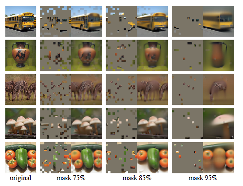
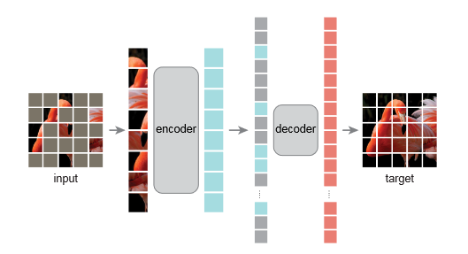
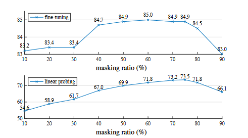
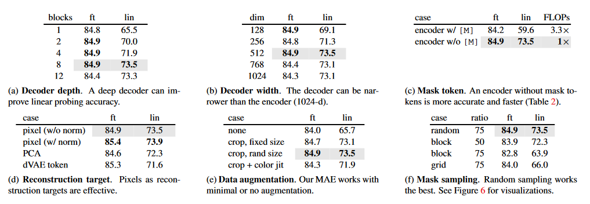

# 思路整理

- transformer：纯基于注意力机制的编码器和解码器
- BERT：基于Transformer的Encoder结构，将模型应用拓展到了更广泛的NLP任务中。BERT采用一种类似完形填空的**自监督学习机制**，即通过Mask掉输入句子中的一部分词，然后预测这些被遮盖的词来进行训练，从而获取对文本的特征抽取的能力。由于这种方法无需人工标注数据，BERT可以在大规模未标注语料上学习有效的文本表示。BERT极大地扩展了Transformer的应用，可以在大规模的、没有标号的数据上训练出非常好的模型。
- ViT：将transformer用到了CV领域。ViT证明了训练数据足够大的时候，transformer架构在CV领域的精度可以超越CNN。
- MAE：BERT的CV版本。MAE基于ViT这篇文章，将整个训练扩展到了没有标好的数据上面。

# 摘要

摘要开篇就介绍Masked Autoencoders (MAE) 是一种适用于**计算机视觉领域的**、可扩展的**自监督学习方法**。也就是说，它不需要大量的人工标注数据，依靠自己构造任务（如重建图像）来学习有效的特征表示。         
MAE 方法的思路非常直接：随机遮盖输入图像的一部分 patch（图像块），然后训练模型去重建被遮盖的像素。这类似于 NLP 中 BERT 的 masked language modeling。             

有两个关键：
1. 非对称的编码器-解码器结构：MAE 采用了非对称的结构设计
- Encoder（编码器）：只处理未被遮盖的图像块（可见部分），从而减小计算成本。
- Decoder（解码器）：结构轻量，利用编码器的输出以及 mask token 来重建原始图像。
> 好处：加快训练速度，节省计算资源，后面会详细介绍。
2. 高比例遮盖：遮盖比例很高（比如 75%）时，仍然能有效训练模型，并且这能使得模型学习到更强的全局图像理解能力。

实验表现：作者用 MAE 预训练后，对 ViT-Huge 模型在 ImageNet-1K 数据上进行微调（fine-tuning），达到了 87.8% 的 SOTA 精度，超过了当时其他仅用 ImageNet-1K 的方法。

迁移能力： MAE 在下游任务（如分类、检测、分割）中的迁移能力也很强，优于传统的有监督预训练方法。

# 1 Introduction

深度学习的发展依赖大量标注数据，模型规模迅速扩大，参数量动辄上亿，这使得获取充足的**有标签图像数据**成为模型提升的瓶颈，但是相比之下，自然语言处理（NLP）通过自监督预训练解决了类似问题（BERT和GPT），不再严重依赖标签数据。

在 NLP 中，自监督方法的核心思想是：**“遮盖一部分数据，训练模型去重建它”**。

受此启发，作者认为在CV领域自编码器也自然适用。作者认为：Masked Autoencoders 本质上是 Denoising Autoencoders 的一种形式，原因如下：
1. 在过去十年中，视觉领域主要由卷积神经网络（CNN）主导，但 CNN 结构限制了使用 masked autoencoding 的可能性，ViT 的出现消除了这一结构障碍，使得 MAE 方法得以在视觉领域应用。
2. 语言和视觉之间的一个根本性差异是：信息密度不同。
- 语言的信息密度高：语言具有高度的语义性和信息密度，因此训练模型预测句子中少数几个缺失的词，会迫使模型学会复杂的语言理解能力。
- 图像的冗余性强：相比语言，图像是自然信号，存在大量空间冗余。图像的每个区域之间往往非常相似，缺失一个 patch 时，模型可以只看周围的 patch 就猜出它是什么，不需要真正理解整体结构。这就使得 masked image modeling 的任务变得太简单了，模型可能只是在“抄周围”，而不是理解图像语义。
- 解决方法：为了解决这个问题，并引导模型学习有用的特征，作者提出一个简单但有效的方法：遮盖非常高比例的随机图像块。这样模型就不能光靠周围 patch 猜内容了，必须学会图像的全局语义表示。这种策略大幅度减少了冗余性，构造了一个更具挑战性的自监督任务，迫使模型超越低级图像特征，去进行整体理解。
> 重建任务的视觉效果，可以看Figure 2-4

    

**Figure 2**：             
每一组图像是一个三联图：
- 左边：遮盖后的输入图像（masked image）
- 中间：MAE 重建的图像
- 右边：原始图像

这张图是 MAE 有效性的“视觉证据”。它说明在高遮盖比下（80%），模型仍能产生高质量的图像重建，间接验证 MAE 学到的是具有全局感知能力的特征表示，而不是仅仅依赖局部冗余。

    

**Figure 3**：           
同figure2一样：
- 左边：遮盖后的输入图像（masked image）
- 中间：MAE 重建的图像
- 右边：原始图像

这组的图像不是来自 ImageNet，而是来自 COCO 验证集，但是 MAE 没有在 COCO 上训练，仅在 ImageNet 上训练。但是可以看出在遮盖依然很严重（80% missing），重建效果依旧合理。在 ImageNet 上训练的 MAE 模型也能泛化到不同分布的数据（COCO）上，说明模型不是在“记忆”图像，而是在“理解”图像的语义结构。

    

**Figure 4**：             
第一列：原始图像
第二列：75% 遮盖 → 与训练时一致
第三列：85% 遮盖
第四列：95% 遮盖 → 几乎看不到原图
> 固定一个 MAE 模型，然后输入遮挡程度越来越高的图像，看它还能不能合理地重建

图像重建结果是由训练时使用 75% 遮盖率的模型完成的，即便重建出的图像与原图不完全一致，在语义上仍是合理的（plausible），这说明 MAE 学到的是一种可泛化的语义建模能力，并且 MAE 不依赖于特定的遮盖比例也不依赖于记住具体图像细节，而是通过遮盖任务学会了对图像的通用理解。

3. 在自编码器结构中，Encoder 提取特征，Decoder 重建原始数据。不过，Decoder 在图像和文本中的作用是不同的，在CV任务中，Decoder 要重建的是像素，而在NLP中重建的则是词语。BERT 实际上没有显式 decoder，而是在 encoder 输出上加一个简单的分类头，预测被 mask 掉的词，因为语言本身信息密度高，只需预测几个词即可学到复杂语义。但是在图像任务中，decoder 的设计对于模型学到的语义层级起着关键作用。如果 decoder 太弱，模型可能只学会“补像素”，而非理解物体或场景，但是decoder 设计合理，能够引导 encoder 学到更加抽象、有意义的图像表示。

综合以上三点，作者提出了一种简单、高效、可扩展的 masked autoencoder（MAE）形式，用于图像表示学习。

MAE 的核心是：
1. 采用一种非对称的 encoder-decoder 结构。
2. 从输入图像中随机遮盖一部分 patch，然后在像素空间中重建这些缺失部分。
- 编码器：仅处理未被遮盖的图像块。
- 解码器：使用编码器输出和 mask token 一起重建原始图像。

优势：
1. 只让 encoder 看 25%，极大减少了计算量，所以速度提升很大。
2. 高遮盖比例（75%）可以使模型学习到更加深层的语义。
3. 综合来看 MAE 表现好，计算负担轻，非常适合大规模预训练。

成果：
1. 性能：MAE 支持大模型训练，泛化能力强，如 ViT-Large / Huge 这种对数据量要求特别大的模型如果使用 MAE 来进行训练的话只需 ImageNet-1K 就能达到 SOTA，并且超过了所有只使用 ImageNet-1K 的现有方法的表现。
2. 泛化：不仅分类任务表现好，目标检测、实例分割、语义分割等迁移任务也能从 MAE 预训练中受益。并且在这些任务中，MAE 预训练的效果优于传统的监督式预训练。
3. 扩展性：MAE 可扩展性很好，随着模型规模变大，性能提升也越明显。

# 2 Related Work

## 2.1 Masked Language Modeling

掩码语言建模（如 BERT）和自回归方法（如 GPT）是 NLP 中非常成功的预训练方法。               
它们的核心思想是：遮盖一部分输入，让模型预测缺失内容。           
MAE 借鉴了这类方法的思想：遮盖输入 → 重建目标。

## 2.2 Autoencoding

自编码是一种经典的表示学习方法，结构包含 encoder + decoder。
- encoder 将输入编码为潜在表示
- decoder 再从中重建原始输入

MAE 是一种去噪自编码（denoising autoencoding），使用 遮盖 patch 的方式，并结合 ViT 架构。

## 2.3 Masked Image Encoding

遮盖图像编码方法是一种自监督学习方式，模型看不见图像的一部分，要求从“缺失信息”的图像中学习如何恢复或理解整体图像。                   
MAE 属于遮盖图像编码（Masked Image Encoding）这一大类，它继承了 Denoising Autoencoder 的思想，又结合了 Transformer 架构和高遮盖策略，是当前非常成功的一种自监督视觉学习方法。

## 2.4 Self-Supervised Learning

自监督学习在CV领域常用于预训练。但之前常见的主要还是对比学习（contrastive learning），如 SimCLR、MoCo，学习“相似 vs 不相似”。          
MAE 是对比学习之外的另一条自监督路径，更易泛化，且大模型友好。

# 3 Approach

          
**Figure 1**

## 3.1 MAE 整体思路

**partial observation：部分观测**             
输入不是完整图像，而是遮掉大部分 patch 后的“残缺图像”，然后使用一个 encoder 提取特征，使用 decoder 重建输入。

## 3.2 Masking 过程

1. 按照 ViT 的做法，将图像分成不重叠的 patch：
- 通常是 16×16 的小块（ViT 默认设定）
- 将整张图像转换成 patch token 序列。

2. 从中采样一部分 patch 保留，其余的全部遮盖（移除），采用随机采样，在不放回的情况下随机选择 patch

## 3.3 高遮盖率的好处

有效去除图像冗余，迫使模型去理解整体结构和深层语义。同时 encoder 处理起来也更加高效。

## 3.4 MAE encoder 设计

MAE 的编码器结构基于 ViT，但只用于处理未遮盖的 patch。           
每个 patch 都会通过线性变换+位置编码得到 token，输入到 Transformer 中。             
遮盖区域的处理推迟到 decoder。   

## 3.5 MAE decoder 设计

MAE 解码器的输入是完整的 token 集合，包括：
- 编码后的可见 patch；
- 被遮盖位置对应的 mask token。

**这里解释一下**：
Encoder：只接收未被遮盖的patches，比如一张图被分成100个patch，遮盖了75个，只留下25个可见的，那么编码器只处理这25个，其输入是这些未遮挡的patch，这样可以大大减少计算量。             
Decoder 的输入包括：
- Encoder输出的可见patch的特征表示
- Mask token：这些是为了“占位”那些被遮挡掉的patch，是一个固定的learnable向量（不是真实图像内容）
- Position Embedding：持位置信息一致
> 也就是说decoder看不见原始的图像，拿到的只是encoder对原始图像中可见部分处理后的特征，哪怕是原始图像没有被遮盖的部分也看不见。

MAE 的 decoder 只在预训练阶段使用，在下游任务中并不会用到，所以你可以为 decoder 选用任意架构，不会影响后续迁移任务；

## 3.6 Reconstruction target

MAE 的重建目标是对每个被遮盖的 patch 预测其像素值，方法为：
- decoder 输出的是一个 patch 的像素向量；
- 最后一层是线性投影，输出维度 = patch 的像素数（如 16×16×3）；
- 损失函数为 MSE，只在被遮盖的 patch 上计算（与 BERT 相似）。

还有一种变体：重建目标是标准化后的像素值，即每个 patch 减去均值、除以标准差后进行预测，这种标准化可以提升表示学习的质量（更稳定，更关注结构而非具体像素）
> 原始 MAE 是让模型预测 每个被遮盖 patch 的原始像素值。
这个“变体”是让模型预测 每个被遮盖 patch 的标准化后像素值。

## 3.7 Simple implementation

实现流程如下：
1. 生成所有 patch 的 token（线性投影 + 位置编码）；
2. 随机打乱这些 token 列表；
3. 根据 mask 比例，保留前 N 个 token 送入 encoder，删除剩下的；
4. encoder 输出后，将 mask token 加回 token 列表，并“逆打乱”，恢复原顺序；
5. 送入 decoder，进行重建任务（加位置编码）；

          
**Figure 5**：不同遮盖比例下的 ImageNet-1K 验证集准确率 (%)          

分为两个实验设置：
1. 上图（Top）：Fine-tuning 微调性能
- 表示使用 MAE 预训练后，对 encoder 进行全部微调（fine-tuning）后的准确率。
- y 轴是 top-1 accuracy，x 轴是不同的遮盖比例（从 10% 到 90%）。
2. 下图（Bottom）：Linear probing 性能
- 表示预训练后，仅训练一个线性分类器，而 encoder 参数冻结（不更新）。
- 衡量的是预训练所学表示的“通用性”。

结果：
- 遮盖 75% 是最佳点，训练挑战足够、信息又不至于过少，促进语义学习
- 遮盖太少学不到全局结构，任务太简单
- 遮盖太多信息不足，模型无法有效学习

# 4 ImageNet Experiments

本段讲述的是如何使用 MAE 在 ImageNet-1K 上进行自监督预训练，并验证其效果。           

**实验设置简介**：在 ImageNet-1K 上进行了自监督预训练,然后通过监督方式进行下游任务训练，验证所学表示的有效性，下游任务包括：
- End-to-end fine-tuning（全网络微调），衡量模型整体训练后的性能
- Linear probing（冻结 encoder，仅训练线性分类头），预训练 encoder 表示的质量（不调整参数的表现）。

对比实验使用 ViT-L/16 作为主干网络，效果显著：
| 模型                     | Top-1 Accuracy (%) |
|------------------------|--------------------|
| 从零训练（官方）        | 76.5               |
| 从零训练（作者自己实现）| 82.5               |
| MAE 预训练 + 微调       | **84.9**           |

> 微调只用了 50 轮，而从零训练需要 200 轮，说明模型能快速适应新任务

## 4.1 Main Properties

   

**Table 1**：ViT-L/16 在 ImageNet-1K 上进行的消融实验，分析 MAE 各种设计选择对模型性能的影响

| blocks | ft   | lin  |
|--------|------|------|
| 1      | 84.8 | 65.5 |
| 2      | 84.9 | 70.0 |
| 4      | 84.9 | 71.9 |
| 8      | **84.9** | **73.5** |
| 12     | 84.4 | 73.3 |

**(a) Decoder depth**

实验内容：调整 decoder 的层数（Transformer blocks），看其对性能的影响。              
结果：
- 微调表现（ft）在 2~8 层时几乎一致（~84.9）；
- 线性探测（lin）随着 decoder 深度增加而略有提升，8 层最优（73.5%）。

结论：
- decoder 深度对 fine-tuning 影响不大；
- 但 deeper decoder 有助于学得更好的表示，对 linear probing 有利。

| dim  | ft   | lin  |
|------|------|------|
| 128  | 84.9 | 69.1 |
| 256  | 84.8 | 71.3 |
| 512  | **84.9** | **73.5** |
| 768  | 84.4 | 73.1 |
| 1024 | 84.3 | 73.1 |

**(b) Decoder width**

实验内容：改变 decoder 的隐藏层维度（宽度）。                  
结果：
- 最佳精度在 dim=512 时达到（ft: 84.9%，lin: 73.5%）；
- 过小过大都会略微影响表示质量。

结论：
- 不需要 decoder 和 encoder 同样大（1024d）；
- 一个宽度适中的 decoder（如 512）就足够有效。

| case           | ft   | lin  | FLOPs |
|----------------|------|------|-------|
| encoder w/ [M] | 84.2 | 59.6 | 3.3×  |
| encoder w/o [M]| **84.9** | **73.5** | **1×**    |

**(c) Mask token**

实验内容：是否将 mask token 输入 encoder                    
- encoder with mask token（带 mask token）：ft=84.2，lin=59.6，FLOPs 为 3.3×；
- encoder without mask token（不输入 mask token）：ft=84.9，lin=73.5，FLOPs = 1×

结论：
- 不使用 mask token（只输入可见 patch）不仅更快，还能获得更好结果；
- 非对称设计是关键：encoder 不需要“看到”遮挡区域。

| case            | ft   | lin  |
|------------------|------|------|
| pixel (w/o norm) | **84.9** | **73.5** |
| pixel (w/ norm)  | 85.4 | 73.9 |
| PCA              | 84.6 | 72.3 |
| dVAE token       | 85.3 | 71.6 |

**(d) Reconstruction target**

实验内容：测试不同重建目标的效果
- 像素（未归一化）：直接用原始像素值作为重建目标（默认设置）；
- 像素 + 归一化：对每个 patch 内像素进行归一化（减均值、除标准差），再作为目标；
- PCA：将 patch 转为主成分空间再重建；
- dVAE token：使用 BEiT 式的离散 token（离散编码）作为重建目标。

结论：
- 使用像素作为重建目标非常有效；
- 加上归一化可以进一步提升性能；
- 比 BEiT 使用的 dVAE token 更优（也更简单）。

| case              | ft   | lin  |
|-------------------|------|------|
| none              | 84.0 | 65.7 |
| crop, fixed size  | 84.7 | 73.1 |
| crop, rand size   | **84.9** | **73.5** |
| crop + color jit  | 84.3 | 71.9 |

**(e) Data augmentation**

实验内容：比较不同的数据增强方式对 MAE 训练的影响
- 无增强：直接输入图像；
- fixed size：使用固定大小的裁剪
- random resized：随机裁剪并缩放图像；
- crop + color jitter：在裁剪基础上增加颜色扰动。

结论：
- MAE 不太依赖 heavy augmentation（不像对比学习）；
- 简单的 crop 足够，不需要额外的数据增强。

| case  | ratio | ft   | lin  |
|-------|--------|------|------|
| random| 75     | **84.9** | **73.5** |
| block | 50     | 84.3 | 72.3 |
| block | 75     | 82.8 | 63.9 |
| grid  | 75     | 84.0 | 66.0 |

**(f) Mask sampling**

实验内容：Mask 采样方式对模型性能影响
- random：随机遮盖
- block：遮盖连续块
- grid：网格遮盖

结论：
- 随机遮盖（random sampling）效果最好

| encoder       | dec. depth | ft acc | hours | speedup |
|---------------|------------|--------|--------|---------|
| ViT-L, w/ [M] | 8          | 84.2   | 42.4   | -       |
| ViT-L         | 8          | 84.9   | 15.4   | 2.8×    |
| ViT-L         | 1          | 84.8   | 11.6   | 3.7×    |
| ViT-H, w/ [M] | 8          | -      | 119.6† | -       |
| ViT-H         | 8          | 85.8   | 34.5   | 3.5×    |
| ViT-H         | 1          | 85.9   | 29.3   | 4.1×    |

**Table 2**：展示 MAE 预训练过程中的 实际训练时间，并比较不同配置下的效率与精度权衡

1. encoder：所使用的主干模型（ViT-L 或 ViT-H）
- ViT-L：ViT-Large（更轻）
- ViT-H：ViT-Huge（更大）
- w/ [M]：encoder 输入包含 mask token（即非 MAE 的对照组）
- 无 w/ [M]：即 MAE 默认设置（encoder 只看可见 patch）

2. dec. depth：decoder 深度（即 Transformer 层数），一般为 8 层，也有一个是 1 层（测试轻量 decoder 对效率的影响）

3. ft acc：Fine-tuning 后在 ImageNet-1K 上的 top-1 精度，衡量预训练有效性的标准。

4. hours：完成 800 轮（epoch）预训练所需的总时间（在 128 个 TPU v3 上）
- 单位为小时；
- 第一个 ViT-H 条目（带 mask token）用 † 标注，是根据前 10 个 epoch 估算的。

1. MAE采用非对称的编码解码结果，mask符号在解码端加入，25%可见的patch在编码端，那么在下游任务中，编码端是会看到全部patch的，而不是25%，这是不是一个预训练和微调的一个gap呢。

2. VIT其实也有做这个实验，我接的应该只是用了50%patch和l2损失，但是效果差很多，这是不是因为调参的原因，还是有其他原因。

1. 这个可能是个问题 2. 是因为mae解码器也用了transformer，而且vit最原始的训练超参数不行，估计作者没仔细调